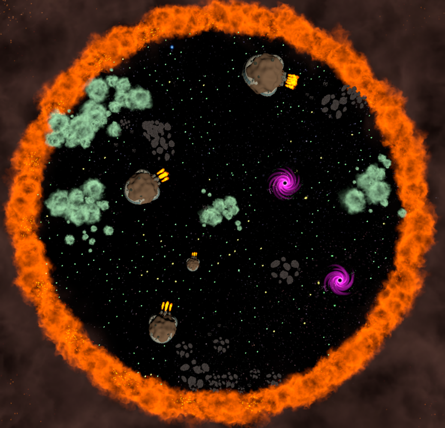

# Tubes1_PlayerNumberOne
Tugas Besar 1 IF2211 – Strategi Algoritma Tahun 2022/2023

## Table of Contents
* [General Info](#general-information)
* [Technologies Used](#technologies-used)
* [Penjelasan Singkat Algoritma](#Penjelasan-Singkat-Algoritma)
* [Features](#features)
* [Screenshots](#screenshots)
* [Setup](#cara-menjalankan-program)
* [Project Status](#project-status)
* [Room for Improvement](#room-for-improvement)
* [Pembagian](#pembagian-tugas)

## General Information
Galaxio adalah sebuah game battle royale yang mempertandingkan bot kapal anda dengan beberapa bot kapal yang lain. Setiap pemain akan memiliki sebuah bot kapal dan tujuan dari permainan adalah agar bot kapal anda yang tetap hidup hingga akhir permainan. Penjelasan lebih lanjut mengenai aturan permainan akan dijelaskan di bawah. Agar dapat memenangkan pertandingan, setiap bot harus mengimplementasikan strategi tertentu untuk dapat memenangkan permainan.

## Technologies Used
- java (minimal java 11)
- .Net Core 5.0

## Penjelasan Singkat Algoritma

## Features
- Implementasi dari algoritma greedy pada kode program bot PlayerNumberOne
- Optimalisasi algoritma dengan pendekatan heuristic

## Screenshots

## Cara menjalankan program 
Berikut merupakan cara menjalankan game secara lokal di Windows:
1. Lakukan konfigurasi jumlah bot yang ingin dimainkan pada file JSON ”appsettings.json” dalam folder “runner-publish” dan“engine-publish”
2. Buka terminal baru pada folder runner-publish.
3. Jalankan runner menggunakan perintah “dotnet GameRunner.dll”
4. Buka terminal baru pada folder engine-publish
5. Jalankan engine menggunakan perintah “dotnet Engine.dll”
6. Buka terminal baru pada folder logger-publish
7. Jalankan engine menggunakan perintah “dotnet Logger.dll”
8. Jalankan seluruh bot yang ingin dimainkan
9. Setelah permainan selesai, riwayat permainan akan tersimpan pada 2 file JSON “GameStateLog_{Timestamp}” dalam folder “logger-publish”. Kedua file tersebut diantaranya GameComplete (hasil akhir dari permainan) dan proses dalam permainan tersebut.

## Project Status
Project is: _complete_ 

## Room for Improvement

Room for improvement:
- speed up for algorithm
- algorithm optimization

## Pembagian Tugas
1. Nigel Sahl (13521043)                : brainstorming, membuat alternatif solusi dari algoritma greedy, menulis laporan 
2. Hanif Muhammad Zhafran (13521157)    : brainstorming, membuat alternatif solusi dari algoritma greedy, menulis laporan 
3. Hosea Nathanael Abetnego (13521057)  : brainstorming, membuat alternatif solusi dari algoritma greedy, menulis laporan 